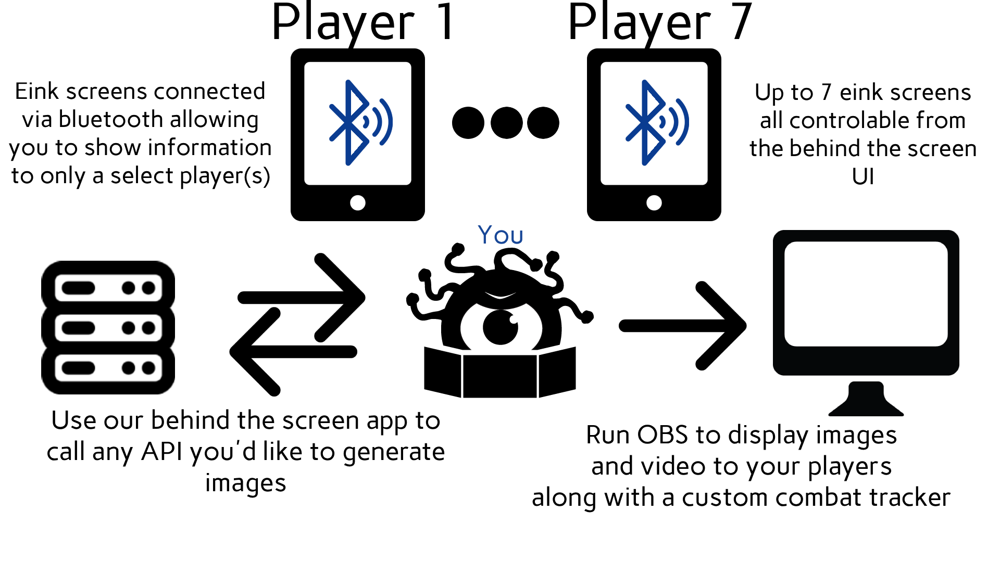

## SageSlate
SageSlate Eink display used for TTRPGs, along with a custom battle tracker. This project is still actively being developed

### Overview
SageSlate consists of two main components:

- Hardware: Custom e-ink displays designed for low power consumption and high readability.
- Software: A Linux-based control system that manages the e-ink displays remotely via Bluetooth.

The core concept of SageSlate is to provide a seamless, wireless way to control and update e-ink displays from a Linux machine. 

## Getting Started
You'll need a system with:
- linux, I have no intension of making a windows implementation (other are of course welcome to make a banch for that)
- Bluetooth
### Per Display
- 4.2 inch E-ink display (I used https://www.amazon.co.uk/dp/B074NR1SW2?ref=ppx_yo2ov_dt_b_fed_asin_title)
- ESP32 with some way form of e-Paper Driver Board (I used https://www.amazon.co.uk/dp/B07M5CNP3B?ref=ppx_yo2ov_dt_b_fed_asin_title)
- 3.7v Batteries (I use two of these https://www.amazon.co.uk/dp/B08FD3V6TF?ref=ppx_yo2ov_dt_b_fed_asin_title)
- USB charger (only if you want it to be rechangable) (I used https://www.amazon.co.uk/dp/B09Q838ZML?ref=ppx_yo2ov_dt_b_fed_asin_title)
- Some wire (recommend multi-thread as some of the wire need to bend quite a lot)
- Access to a 3D printer

